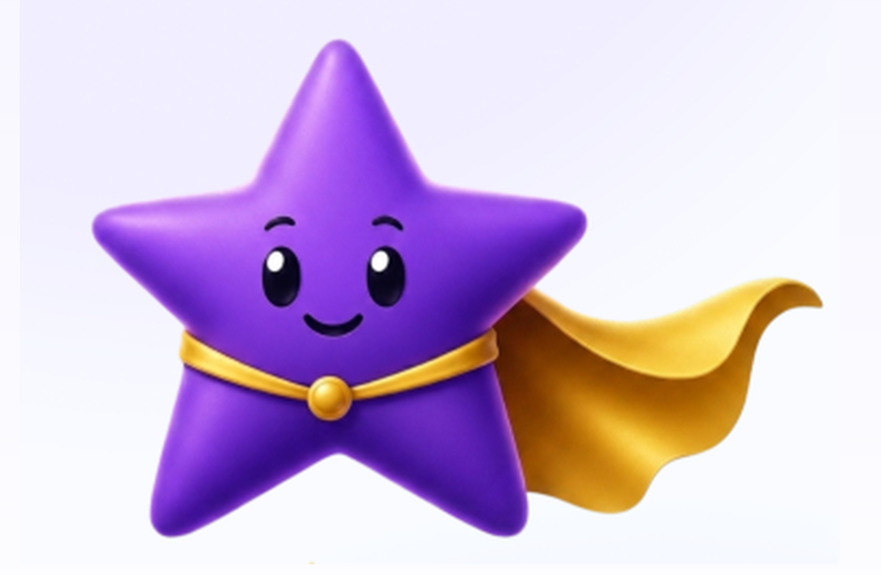
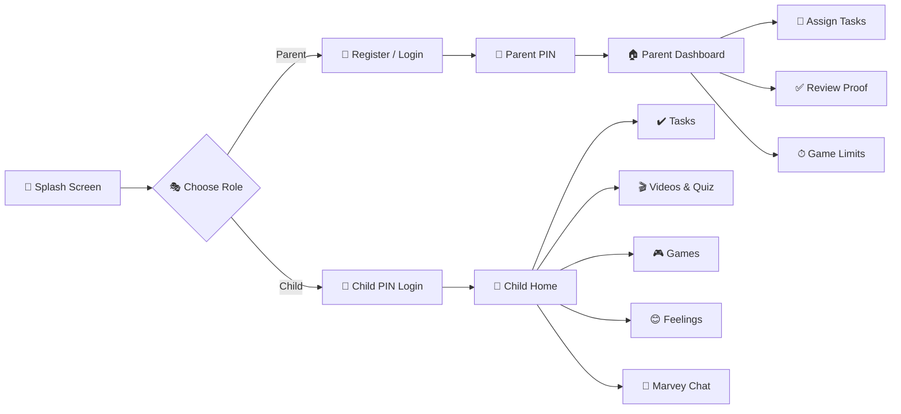
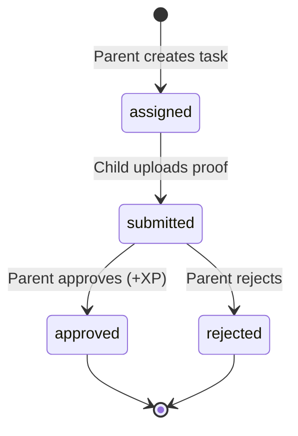
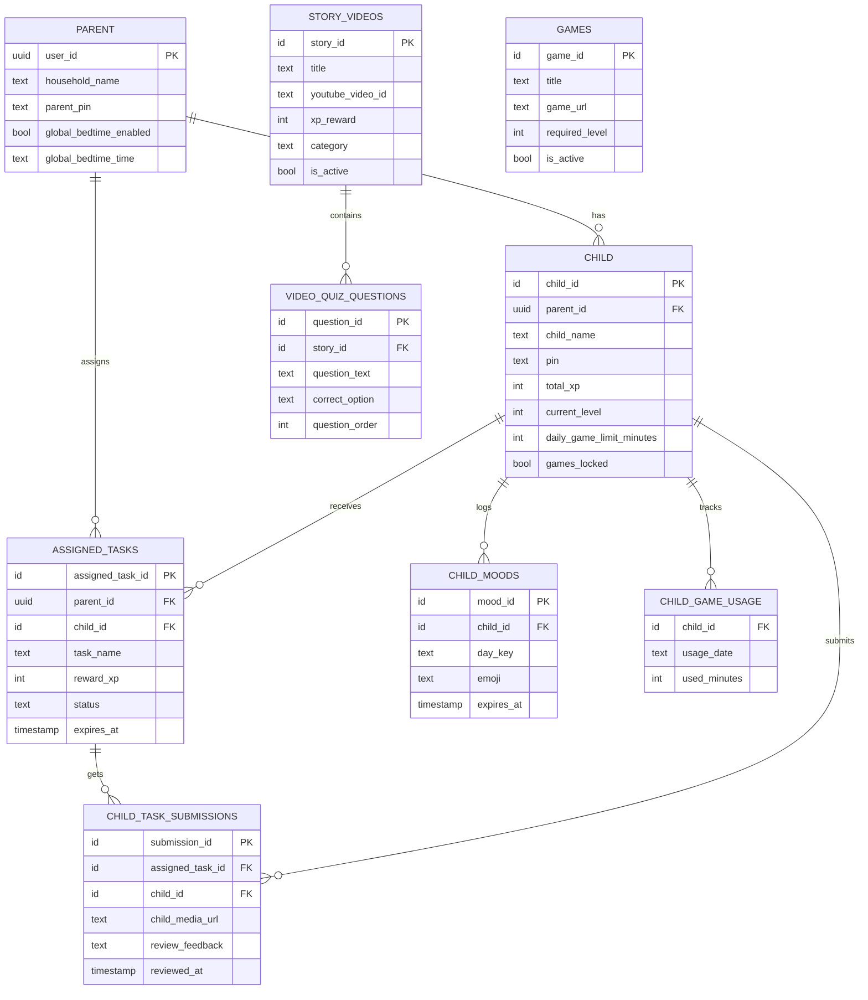
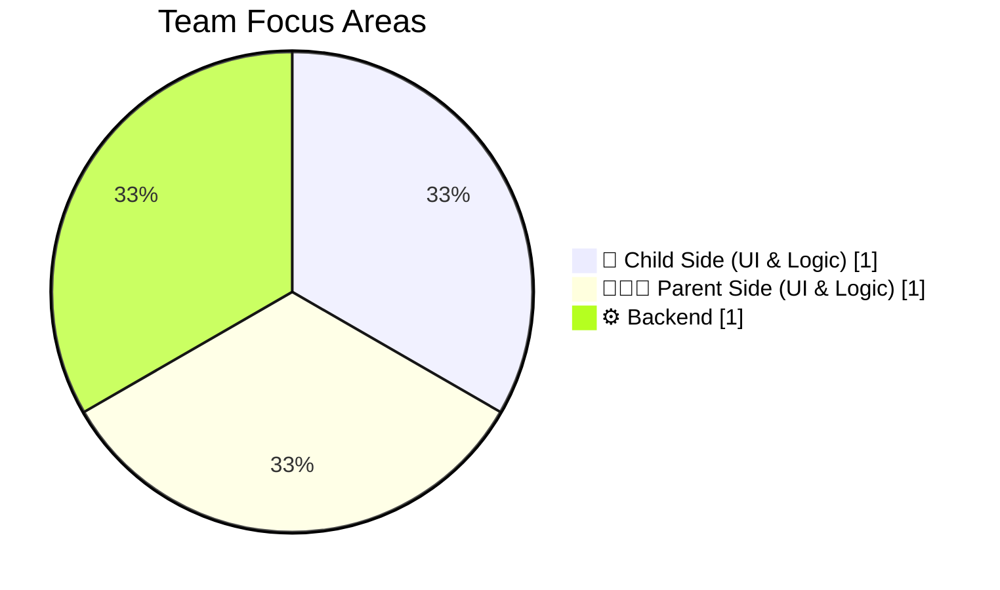

<div align="center">



# ✨ Mini Marvels ✨

### A playful parent–child app for tasks, learning, games, moods & rewards

*Turn everyday routines into adventures — where every task earns XP and every day is a chance to learn.*

<br/>


<br/>

[📖 About](#-about-the-project) •
[🌟 Features](#-features) •
[🛠 Tech Stack](#-tech-stack) •
[🗂 Structure](#-project-structure) •
[🗄 Database](#-database-schema) •
[🚀 Getting Started](#-getting-started) •
[🤝 Contribution](#-contribution) •
[👥 Team](#-team--contributions)

</div>

---

## 📖 About the Project

**Mini Marvels** is a Flutter application that brings parents and children together in one safe, rewarding space. Parents assign real-life tasks, review photo/video proof, and award XP. Children complete tasks, watch learning videos, take quizzes, chat with a friendly AI buddy called **Marvey**, play unlocked games, and record how they feel each day.

> 💡 **The big idea:** motivate good habits through positive reinforcement — while giving parents full control over screen time, bedtime, and rewards.

### 🔑 How it works

| 👨‍👩‍👧 Parents | 🧒 Children |
|---|---|
| Register & log in with **Supabase Auth** | Log in quickly with a **4-digit PIN** |
| Create a household & add child profiles | See a fun personal dashboard |
| Assign tasks with optional example media | Complete tasks & upload proof (photo/video) |
| Review proof, approve or reject, award XP | Earn XP, level up, unlock games |
| Set game limits & bedtime lock | Learn through videos & quizzes |

---

## 🌟 Features

### 👨‍👩‍👧 Parent Side

- 🔐 **Secure access** — Supabase Auth login plus an extra app-level Parent PIN
- 👶 **Family management** — add, edit and delete child profiles; rename the household
- 📝 **Task assignment** — create tasks with a title, details, reward XP and optional example image/video
- 📊 **Task tracking** — see every task and its status (`assigned`, `submitted`, `approved`, `rejected`) per child
- ✅ **Proof verification** — view submitted media, approve or reject, and award XP automatically
- ⏱ **Game controls** — per-child daily time limit, game lock toggle and a global bedtime lock

### 🧒 Child Side

- 🎒 **Personal dashboard** — XP, level, and quick access to every feature
- ✔️ **Task list & details** — 24-hour countdown, example media and proof upload
- 📸 **Proof submission** — upload an image or video, add a note, submit for review
- 🤖 **Marvey AI Chat** — a child-safe, encouraging AI buddy powered by Gemini
- 🎬 **Story & learning videos** — YouTube videos across Stories, Learning, Science & Nature, General Knowledge, Safety, and Fun & Songs
- 🧠 **Video quizzes** — answer questions after each video and earn bonus XP
- 🎮 **Games** — level-gated games with XP checks, locks, bedtime and daily limits
- 😊 **My Feelings** — save one mood per weekday and view the last 7 days

---

## 🔄 App Flow



### 📌 Task Lifecycle



---

## 🛠 Tech Stack

| Layer | Technology |
|---|---|
| 📱 **Framework** | Flutter & Dart (SDK `^3.9.2`), Material UI |
| 🔐 **Authentication** | Supabase Auth (parents) + PIN-based child login |
| 🗄 **Database** | Supabase Postgres |
| 📦 **Storage** | Supabase Storage (`task-media` bucket) |
| ⚡ **Serverless** | Supabase Edge Function (`marvey-chat`, TypeScript/Deno) |
| 🤖 **AI** | Google Gemini (`gemini-2.5-flash-lite`, fallback `gemini-2.5-flash`) |

<details>
<summary><b>📦 Key Flutter packages</b></summary>

<br/>

| Package | Purpose |
|---|---|
| `supabase_flutter` | Auth, database, storage, edge functions |
| `image_picker` / `image_picker_for_web` | Pick proof and example media |
| `video_player` | Play uploaded task videos |
| `youtube_player_flutter` | Play learning videos |
| `webview_flutter` (+ platform packages) | Run games inside the app |
| `url_launcher` | Open external links |
| `speech_to_text` | Voice input |
| `flutter_launcher_icons` | Generate app icons |
| `flutter_lints` | Code quality rules |

</details>

---

## 🗂 Project Structure

```text
project_1/
├── 📁 lib/
│   ├── 📄 main.dart                     # Supabase init & app bootstrap
│   ├── 📁 user_authentication/          # Splash, role select, parent & child auth
│   ├── 📁 parent/                       # Dashboard, tasks, verification, family, game limits
│   └── 📁 child/                        # Dashboard, tasks, games, feelings, Marvey chat
│       └── 📁 All Video Feature/        # Videos, YouTube player, quiz, XP reward
├── 📁 supabase/
│   ├── 📄 config.toml
│   └── 📁 functions/marvey-chat/        # Gemini-powered AI chat (index.ts)
├── 📁 assets/icon/                      # App icon
├── 📁 android · ios · web · windows · macos · linux
├── 📄 pubspec.yaml
└── 📄 README.md
```

<details>
<summary><b>📂 Important Dart files</b></summary>

<br/>

**🔐 Authentication** — `lib/user_authentication/`

| File | Purpose |
|---|---|
| `splash_screen_page.dart` | First screen after launch |
| `role_screen.dart` | Choose Child or Parent |
| `parent_register.dart` | Sign-up + `parent` row insert |
| `parent_login.dart` | Email/password login |
| `parent_authentication.dart` | Parent PIN verification |
| `child_login.dart` | Child PIN login under the parent session |

**👨‍👩‍👧 Parent** — `lib/parent/`

| File | Purpose |
|---|---|
| `parent_dashboard.dart` | Children list & pending submission counts |
| `parenthub.dart` | Parent navigation hub |
| `addmemberpage.dart` | Add a child profile |
| `manage_family_page.dart` | Household & child management |
| `addnewtaskpage.dart` | Create tasks & upload example media |
| `all_task_tracking.dart` | All tasks per child |
| `all_task_for_verification.dart` | Submissions waiting for review |
| `taskverificationpage.dart` | Approve / reject & award XP |
| `gamelimitspage.dart` | Game limit, lock & bedtime |

**🧒 Child** — `lib/child/`

| File | Purpose |
|---|---|
| `child_homepage.dart` | Dashboard & access checks |
| `all_tasks_page.dart` | Active assigned tasks |
| `task_details_page.dart` | Details, countdown & proof upload |
| `marvey_chat_page.dart` | Calls the `marvey-chat` Edge Function |
| `games_page.dart` | Game list with XP, level & time rules |
| `game_player_page.dart` | WebView player & usage tracking |
| `my_feelings_page.dart` | Mood saving & 7-day history |
| `All Video Feature/` | Videos, player, quiz, XP reward |

</details>

---

## 🗄 Database Schema

The schema below is inferred from the Dart code. Always verify it in the **Supabase dashboard** before making destructive changes.



### 📋 Tables at a glance

| Table | Purpose |
|---|---|
| 👨‍👩‍👧 `parent` | Parent profile, PIN and bedtime settings |
| 🧒 `child` | Child profile, XP, level and game settings |
| 📝 `assigned_tasks` | Tasks assigned by parents to children |
| 📤 `child_task_submissions` | Child proof and parent review result |
| 🎬 `story_videos` | Active YouTube learning videos |
| ❓ `video_quiz_questions` | Quiz questions linked to videos |
| 🎮 `games` | Game catalog with required levels |
| ⏱ `child_game_usage` | Daily game minutes per child |
| 😊 `child_moods` | Weekly mood records (expire after 7 days) |

### 🏷 Status values

| Field | Allowed values |
|---|---|
| `assigned_tasks.status` | `assigned` · `submitted` · `approved` · `rejected` |
| `child_task_submissions.review_feedback` | `submitted` · `approved` · `not-approved` |

---

## 📦 Storage

**Bucket:** `task-media`

```text
# 👨‍👩‍👧 Parent example media
<parentId>/children/<childId>/assigned_tasks/<timestamp>.<ext>

# 🧒 Child proof media
<parentId>/children/<childId>/assigned_tasks/<assignedTaskId>/submissions/<timestamp>.<ext>
```

- 🔗 Storage **paths** are saved in the database; **signed URLs** (valid for 7 days) are generated on display.
- 🖼 Images: `jpg`, `png`, `webp`, `gif`
- 🎞 Videos: `mp4`, `webm`, `m4v`

---

## 🤖 Marvey AI — Edge Function

`supabase/functions/marvey-chat/index.ts`

| Setting | Value |
|---|---|
| 🧠 Model | `gemini-2.5-flash-lite` (fallback: `gemini-2.5-flash`) |
| 💬 Max message length | 800 characters |
| 🕘 History kept | Last 4 messages |
| ⏳ Timeout | 20 seconds |
| 🎛 Max output tokens | 220 |
| 🌡 Temperature | 0.6 |

**Request** → `{ "childId": "...", "message": "...", "history": [...] }`
**Response** → `{ "reply": "..." }`

Marvey is designed to be warm, encouraging and child-safe — helping with learning, stories, quizzes, tasks, feelings, good habits and math.

---

## 📐 Core Business Rules

<details>
<summary><b>✔️ Task creation & completion</b></summary>

<br/>

- Parents can only assign tasks to children where `child.parent_id = currentUser.id`.
- A task needs a name and a positive reward XP.
- Children can open a task only if it is `assigned` and not yet expired.
- Proof media is required before submitting.
- On submit: media is uploaded → a submission row is created → task status becomes `submitted`.

</details>

<details>
<summary><b>🏅 Review & XP</b></summary>

<br/>

- **Approve:** checks the submission was not already reviewed → adds `reward_xp` to `child.total_xp` → marks submission and task as `approved`.
- **Reject:** marks submission as `not-approved` and task as `rejected`.
- Quiz XP is added directly to `child.total_xp`.

</details>

<details>
<summary><b>🎮 Game access</b></summary>

<br/>

A child is blocked from games when:

- 🔒 `games_locked = true`
- 🌙 the current time is past the parent's bedtime lock (when enabled)
- ⏱ daily usage reaches the limit (`0` = unlimited)
- ⭐ total XP is too low

Each game is also locked until the child reaches its `required_level`.

</details>

---

## 🚀 Getting Started

### ✅ Prerequisites

- [Flutter SDK](https://docs.flutter.dev/get-started/install) (Dart `^3.9.2`)
- A [Supabase](https://supabase.com) project
- [Supabase CLI](https://supabase.com/docs/guides/cli) (for the Edge Function)
- A [Google Gemini API key](https://aistudio.google.com/apikey)

### 📥 1. Clone & install

```bash
git clone https://github.com/<your-username>/project_1.git
cd project_1
flutter pub get
```

### 🔧 2. Configure Supabase

Open `lib/main.dart` and set your own project values:

```dart
await Supabase.initialize(
  url: 'https://<your-project-ref>.supabase.co',
  anonKey: '<your-anon-or-publishable-key>',
);
```

Then create the tables listed in [Database Schema](#-database-schema), create a Storage bucket named **`task-media`**, and enable **Row Level Security** with proper policies.

### ⚡ 3. Deploy the Marvey Edge Function

```bash
supabase login
supabase link --project-ref <your-project-ref>

# Add your secrets (never commit these!)
supabase secrets set GEMINI_API_KEY=<your-gemini-key>
supabase secrets set GEMINI_MODEL=gemini-2.5-flash-lite   # optional

supabase functions deploy marvey-chat
```

### ▶️ 4. Run the app

```bash
flutter run                 # connected device or emulator
flutter run -d chrome       # web
```

### 🎨 5. (Optional) Regenerate app icons

```bash
dart run flutter_launcher_icons
```

---

## 🔒 Security Notes

- ✅ The Supabase **anon/publishable key** is safe to ship in clients — but only when **Row Level Security** protects every table and bucket.
- 🚫 **Never commit** the Supabase service-role key, the Gemini API key, or any private secret.
- ⚠️ Parent and child PINs are currently stored as plain text. A production release should hash them or adopt a stronger auth design.

---

## ⚠️ Known Caveats & Roadmap

- [ ] Add Supabase SQL migrations to the repo
- [ ] Confirm a default/trigger sets `assigned_tasks.expires_at` on insert
- [ ] Add unique constraint on `child_moods (child_id, day_key)`
- [ ] Add unique constraint on `child_game_usage (child_id, usage_date)`
- [ ] Redesign child login if children should sign in without a parent session
- [ ] Hash parent and child PINs
- [ ] Remove the unused `youtube_player_iframe` dependency (or migrate to it)
- [ ] Refactor large page widgets into shared components

---

## 🤝 Contribution

Contributions make this project better for every family that uses it — thank you for helping! 💜

### 🔀 How to contribute

1. 🍴 **Fork** the repository
2. 🌿 **Create a branch**
   ```bash
   git checkout -b feature/your-feature-name
   ```
3. 💻 **Make your changes** and test them
4. ✅ **Commit** with a clear message
   ```bash
   git commit -m "feat: add short description of your change"
   ```
5. 📤 **Push** your branch
   ```bash
   git push origin feature/your-feature-name
   ```
6. 🔃 **Open a Pull Request** describing what you changed and why

### 📏 Contribution guidelines

- Follow the existing page patterns and Supabase access style.
- Run `flutter analyze` and fix lint warnings before opening a PR.
- Do **not** rename tables without checking every `.from('<table>')` call.
- Do **not** change storage path formats unless backward compatibility is handled.
- Preserve task status values: `assigned`, `submitted`, `approved`, `rejected`.
- Preserve submission feedback values: `submitted`, `approved`, `not-approved`.
- Treat `parent_id` in app tables as the Supabase Auth user ID.
- Keep changes focused — one feature or fix per pull request.

### 🏷 Commit message convention

| Prefix | Use for |
|---|---|
| `feat:` | ✨ A new feature |
| `fix:` | 🐛 A bug fix |
| `docs:` | 📚 Documentation changes |
| `style:` | 🎨 UI or formatting changes |
| `refactor:` | ♻️ Code restructuring |
| `chore:` | 🔧 Maintenance tasks |

---

## 👥 Team & Contributions

<div align="center">

| 👤 Team Member | 🎯 Role | 🧩 Contribution |
|:---:|:---:|:---|
| **Syeda Sadiatul Jannat Tushi** | 🧒 **Child Side** <br/> *UI & Logic* | Designed and built the child-facing experience: dashboard, task list & proof submission, learning videos & quizzes, games, My Feelings and the Marvey chat screen. |
| **Bithi Rani Nath Borna** | 👨‍👩‍👧 **Parent Side** <br/> *UI & Logic* | Designed and built the parent-facing experience: dashboard, family management, task assignment & tracking, proof verification and game/bedtime controls. |
| **Utsho Paul** | ⚙️ **Backend** | Set up and managed the Supabase backend: authentication, Postgres database, storage bucket, and the Gemini-powered `marvey-chat` Edge Function. |

</div>

<br/>

<div align="center">



</div>

---

## 📄 License

© 2026 **Mini Marvels Team**. All rights reserved.
*(Add a `LICENSE` file — e.g. MIT — if you want to open-source the project.)*

---

<div align="center">

### 💜 Made with love by the Mini Marvels Team

**Syeda Sadiatul Jannat Tushi** · **Bithi Rani Nath Borna** · **Utsho Paul**

⭐ *If you like this project, give it a star!* ⭐

</div>
